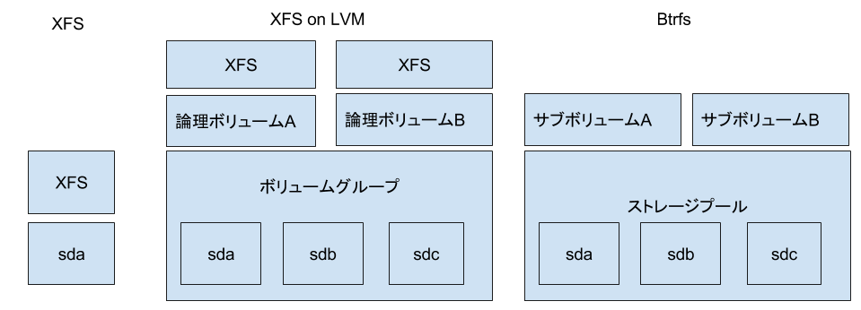
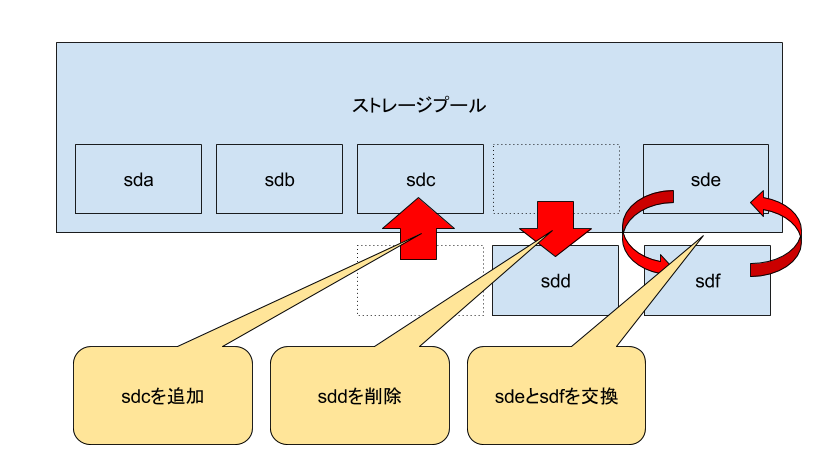
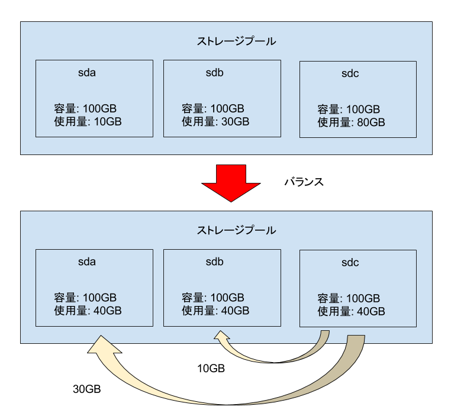

Btrfsは(ext4やXFSなどの)従来型ファイルシステムが提供する機能に加えて、次のような豊富な機能を提供します。

- ストレージプール: 1つないし複数のデバイス(あるいはパーティション。以下単に区別せず、デバイスと記載)から、一つのストレージプールを作成できます
- サブボリューム: サブボリュームとは、上記ストレージプールから切り出したマウント可能な領域です
- スナップショット: ある時点のサブボリュームの内容を持つスナップショットを高速に採取できます
- スナップショットの転送: スナップショットのデータをシリアライズしてファイルや別ホストに転送します。
- RAID: ストレージプールはRAID0を用いてデータを保護できます(RAID0,1,10,5,6をサポート)
- データ破壊検知/修復: ストレージからのデータの読み出し時にデータの破壊を検出できます。ストレージプールのRAID構成が、データのコピーやパリティを持つもの(1,10,5,6)である場合、正しいデータを修復できます。修復できない構成であればデータを捨ててエラーを返します。
- サブボリュームクォータ: サブボリュームごとにストレージの使用量に制限をかけられます
- 透過的圧縮: データを圧縮した状態でストレージに書き込むことによってストレージの容量、および帯域を節約可能です(CPU使用量は増えます)
- デフラグ

上記すべての機能はアンマウントすることなく、オンラインで実現できるため、可用性が高いのが大きな利点です。

本章では、上記の機能のそれぞれについて説明をします。

# ストレージプール

従来型のファイルシステムは1つのデバイスに対して1つのファイルシステムを作成します。Btrfsは、1つないし複数のデバイスから大きなストレージプールを作った上で、その上に、マウント可能なサブボリュームという領域(後述)を作成します。ストレージプールはLVMにおけるボリュームグループ、サブボリュームはLVMにおける論理ボリュームとファイルシステムを足したものに近いです。このように、Btrfsは従来型のファイルシステムの一種と考えるよりも、ファイルシステム+LVMのようなボリュームマネージャと考えるほうがわかりやすいです。

既存のBtrfsファイルシステムに対するデバイスの追加、削除、交換も可能です。それに伴う容量変化に伴うファイルシステムのリサイズ処理は不要です。

運用中に各デバイス内のデータ使用量が偏らないようにするための、デバイス間のデータ量を平準化させることもできます

# サブボリューム

Btrfsのファイルシステムは、作成時にサブボリュームと呼ばれるマウント可能な領域を1つ持っています。サブボリュームは追加で任意の個数を作れます。各サブボリュームは、ストレージプール内の容量を共有しているため、LVMの論理ボリュームのように、個々のデバイスごとに固定的に容量を割り当てる必要はありません。

# スナップショット

Btrfsは、サブボリューム単位でスナップショットを採取できます。スナップショットの作成はデータのフルコピーではなく、データを参照するメタデータの作成、およびスナップショット内のダーティページのライトバックだけで済むため、通常のコピー操作よりもはるかに高速です。元のサブボリュームとスナップショットはデータを共有するため、空間的コストも低いです。

スナップショット作成後に、元のスナップショットあるいはスナップショットのデータを更新すると、コピーオンライト形式で変更した箇所のデータ共有が解除されて、ストレージの使用量が増えます。

作成したスナップショットはサブボリュームと同様、マウント可能です。読み出し専用スナップショットも作れます。

スナップショットの回数には事実上無制限であり、かつ、任意の回数の多段スナップショットも採取可能です。

Btrfsは、サブボリューム単位だけではなく、ファイル単位でもスナップショット相当のものを採取できます。この機能はreflinkと呼ばれています。reflinkもスナップショット同様、新たなファイル用のメタデータのみを作成して、データは元のファイルと共有します。どちらかに書き込みをするとCoW形式でデータの共有が解除されて、ストレージ使用量が増えます。

# サブボリュームの転送

サブボリュームの内容をシリアライズしてストリーム転送できます。ファイルシステム内部構造を意識して動作するため、"cp -a"などによるコピーよりも高速であり、かつ、データ量も少ないです。転送元サブボリュームは読み出し専用でなければなりません。

転送したデータはローカルファイルシステム上のファイル(Btrfs以外のファイルシステム上でも可)に保存してもよいですし、ネットワーク越しに別のホストに転送してもよいです。

シリアライズしたデータは転送元と同じ、あるいは異なるBtrfsファイルシステム上でサブボリュームとして復元できます。

1つのサブボリュームだけではなく、それぞれデータを共有する2つのサブボリューム間の差分を転送することもできます。典型的には親子関係を持つ多段スナップショットに対して使います。親スナップショットを別の場所にストリーム転送したのち、親子スナップショットの差分を転送します。転送先ではまず親スナップショットを復元して、その後、このスナップショットと上記の差分データを元に、子スナップショットも復元できます。後述の通り、これは差分バックアップに利用できます。

# RAID

RAID構成を組めます。サポートしているのはRAID0,1,10,5,6、それにdup(同じデータを同じデバイスに二重化。シングルデバイス用)です。このうち、本書執筆時点ではRAID5,6はまだ安定していないため、一般ユーザが使うものではなく、開発者がテスト用に使うものという扱いです。RAIDの構成単位はサブボリュームごとではなく、Btrfsファイルシステム全体です。

要件に応じて、ユーザのデータそのものと、データの格納場所やファイルの属性などのを保持するメタデータに対して、別のRAID構成をすることもできます。また、後からRAID構成を変更することもできます。

＃ データ破壊検知/修復

データ、メタデータ共に、所定のデータ長ごとにチェックサムを持っています。これを使ってデータの破壊検知が可能です。データ(あるいはメタデータ)を読み出す際にチェックサムエラーを検出すると、そのデータは捨てて、読み出しを依頼したユーザプログラムにはエラーが通知されます。こｋのときRAID1,10,5,6,dup構成であれば、RAID1,10,dupであればもう一方のチェックサムが一致する正しいデータをもとに、破壊されたデータを修復します。RAID5,6の場合もパリティを使って同様のことをします。この場合は、読み出し元はデータが一時的に壊れていたことを意識せずに、処理を継続できます。

データの破壊検知/修復処理はユーザプログラムによってデータを読みに行く際に自動的に動きますが、所定の管理コマンドを使って、明示的に動作させることもできます。

# サブボリュームクォータ

上述の通り、同じBtrfsファイルシステム上の各サブボリュームは1つのストレージプールを共有します。しかし、個々の容量を明に制限することができます。これがサブボリュームクォータという機能です。

サブボリュームは従来型ファイルシステムには無いBtrfs固有の概念なので、サブボリュームクォータは従来型のファイルシステムにおけるユーザごとのクォータ、あるいはディレクトリごとのクォータと同様のことをするには工夫が必要です。前者についてはユーザのホームディレクトリごとにサブボリュームを作る、後者についてはクォータ制限をつけたいディレクトリはサブボリューム化をする必要があります。

# 透過的圧縮

ユーザデータを圧縮してデータ使用量、およびI/O帯域を減らすこともできます。ユーザデータの書き込み時に、データを一旦圧縮した上でストレージに書き込みます。その後に当該データが読み出される際は、今度は圧縮されたデータを展開して元のデータに復元します。

通常のシステム負荷に加えてデータの圧縮、展開によってCPU負荷が上昇します。

# デフラグ

ファイルシステムを長い間使っていると、データがストレージプール内のそれぞれ異なる複数の位置に分散配置されるようになってきます。これをフラグメントと呼びます。フラグメントが発生すると、例えば、あるファイルをシーケンシャルに読み出す際に、ファイルに対応するデータが一つの連続領域に固まっていないため、とくにHDDの場合において、フラグメントしていない状態に比べて読み出し性能が劣化します。

所定の管理コマンドを使えば、ファイルの内容をデフラグできます。

自動的にデフラグさせるオートデフラグという機能もあります。ただしオートデフラグを使用すると、システム負荷に加えて、常にデフラグ処理の負荷も増えるようになります。このため、オートデフラグによって増えるCPUの処理速度やI/O量が許容できるものであるかを判断した上で使用可否を決定する必要があります。
