Btrfsは(ext4やXFSなどの)従来型ファイルシステムが提供する機能に加えて、次のような豊富な機能を提供します。

- ストレージプール: 1つないし複数のデバイス(あるいはパーティション。以下単に区別せず、デバイスと記載)から、一つのストレージプールを作成できます
- サブボリューム: サブボリュームとは、上記ストレージプールから切り出したマウント可能な領域です
- スナップショット: ある時点のサブボリュームの内容を持つスナップショットを高速に採取できます
- スナップショットの転送: スナップショットのデータをシリアライズしてファイルや別ホストに転送します。
- RAID: ストレージプールはBtrfs内蔵のRAID機能を用いてデータを保護できます(RAID0,1,10,5,6をサポート)
- データ破壊検知/修復: ストレージからのデータの読み出し時にデータの破壊を検出できます。ストレージプールのRAID構成が、データのコピーやパリティを持つもの(1,10,5,6)である場合、正しいデータを修復できます。修復できない構成であればデータを捨ててエラーを返します。
- サブボリュームクォータ: サブボリュームごとにストレージの使用量に制限をかけられます
- 透過的圧縮: データを圧縮した状態でストレージに書き込むことによってストレージの容量、および帯域を節約可能です(CPU使用量は増えます)
- 重複排除: ファイルシステム内に存在する重複データの排除によって、ストレージ使用量を削減します
- デフラグ: ファイルのデータがストレージ内の複数個所に断片化したことによる性能劣化を、同データを連続領域に再配置することによってなくします

上記すべての機能はアンマウントすることなく、オンラインで実現できるため、可用性が高いのが大きな利点です。

本章では、上記の機能のそれぞれについて説明をします。

# ストレージプール

従来型のファイルシステムは1つのデバイスに対して1つのファイルシステムを作成します。Btrfsは、1つないし複数のデバイスから大きなストレージプールを作った上で、その上に、マウント可能なサブボリュームという領域(後述)を作成します。ストレージプールはLVMにおけるボリュームグループ、サブボリュームはLVMにおける論理ボリュームとファイルシステムを足したものに近いです。このように、Btrfsは従来型のファイルシステムの一種と考えるよりも、ファイルシステム+LVMのようなボリュームマネージャと考えるほうがわかりやすいです。

既存のBtrfsファイルシステムに対するデバイスの追加、削除、交換も可能です。それに伴う容量変化に伴うファイルシステムのリサイズ処理は不要です。

運用中に各デバイス内のデータ使用量が偏らないようにするための、デバイス間のデータ量を平準化させることもできます

# サブボリューム

Btrfsのファイルシステムは、作成時にサブボリュームと呼ばれるマウント可能な領域を1つ持っています。サブボリュームは追加で任意の個数を作れます。各サブボリュームは、ストレージプール内の容量を共有しているため、LVMの論理ボリュームのように、個々のボリュームごとに容量を決める必要はありません。LVMとBtrfsにおいて、それぞれ使用量が同じ論理ボリューム、あるいはサブボリュームを作った場合の例を示します。

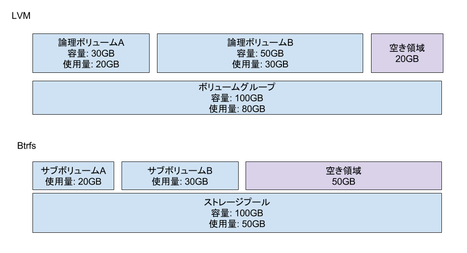

LVMの論理ボリュームはそれぞれ独自の容量を持っているため、空き領域もそれぞれ別に存在します。論理ボリュームの空き領域を増やしたい場合は、ひとつづつ論理ボリュームの拡張、およびファイルシステムの拡張をする必要があります。それに対してBtrfsは全てのサブボリューム間でストレージプール内の容量を共有しているため、気にすべき空き領域はストレージプールのものだけです。容量を追加したければストレージプールにデバイスを追加すればいいだけです。

# スナップショット

Btrfsは、サブボリューム単位でスナップショットを採取できます。スナップショットの作成はデータのフルコピーではなく、データを参照するメタデータの作成、およびスナップショット内のダーティページのライトバックだけで済むため、通常のコピー操作よりもはるかに高速です。元のサブボリュームとスナップショットはデータを共有するため、空間的コストも低いです。

通常のコピーとBtrfsにおけるサブボリュームのスナップショット採取との空間的コストの差を見てみましょう。まずは通常のコピーです。

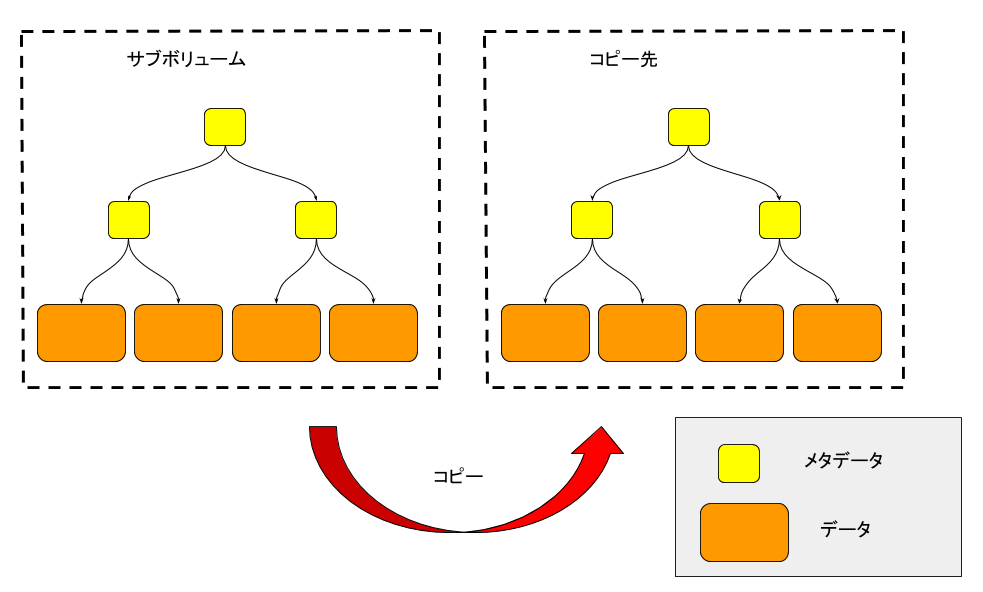

この場合、メタデータを新規作成した上で、データをすべてコピーしていることがわかります。

続いてスナップショットを見てみましょう。

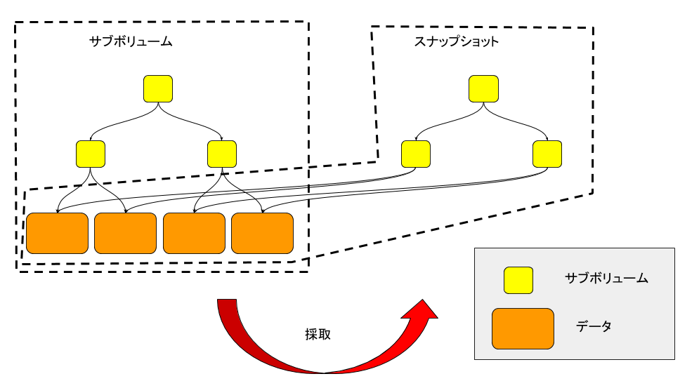

この場合、ツリーの根ノードだけ新規作成して、そこから次のレベルのノードへのリンクを張るだけで済みます。

スナップショット作成後に、元のスナップショットあるいはスナップショットのデータを更新すると、コピーオンライト形式で変更した箇所のデータ共有が解除されて、ストレージの使用量が増えます。

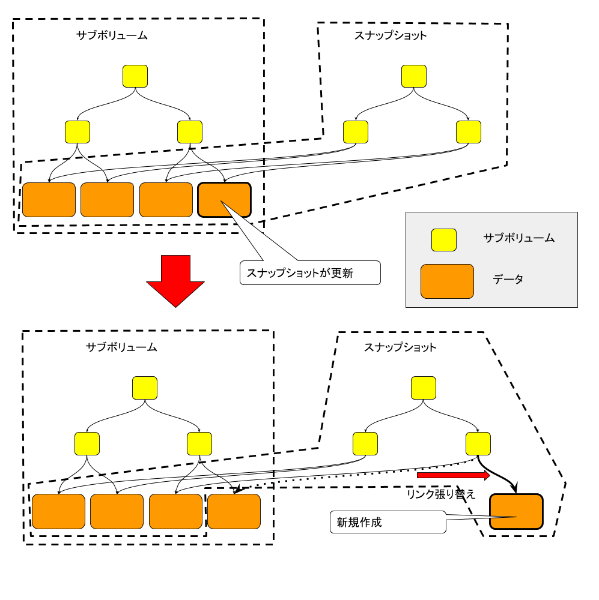

作成したスナップショットはサブボリュームと同様、マウント可能です。読み出し専用スナップショットも作れます。

スナップショットの回数には事実上無制限であり、かつ、任意の回数の多段スナップショットも採取可能です。

Btrfsは、サブボリューム単位だけではなく、ファイル単位でもスナップショット相当のものを採取できます。この機能はreflinkと呼ばれています。reflinkもスナップショット同様、新たなファイル用のメタデータのみを作成して、データは元のファイルと共有します。どちらかに書き込みをするとCoW形式でデータの共有が解除されて、ストレージ使用量が増えます。

# サブボリュームの転送

サブボリュームの内容をシリアライズしてストリーム転送できます。ファイルシステム内部構造を意識して動作するため、高速であり、かつ、転送データ量も少ないです。転送元サブボリュームは読み出し専用でなければなりません。転送したデータはローカルファイルシステム上のファイル(Btrfs以外のファイルシステム上でも可)に保存してもよいですし、ネットワーク越しに別のホストに転送してもよいです。シリアライズしたデータは転送元と同じ、あるいは異なるBtrfsファイルシステム上でサブボリュームとして復元できます。

次に示す図は、サブボリュームAをシリアライズしたデータを

- ファイルに保存、あるいは
- ネットワーク越しに別ホストに転送、あるいは
- サブボリュームBの配下に復元

した図です。

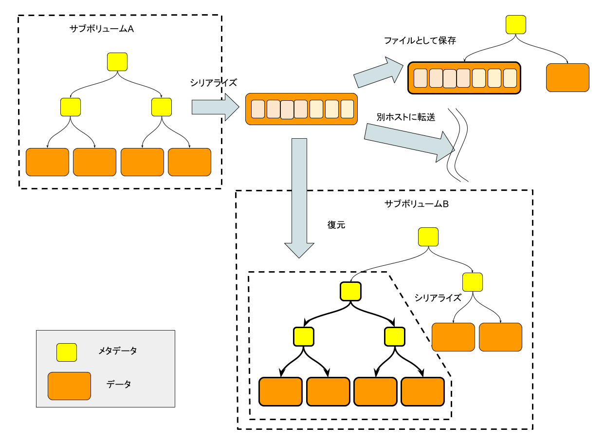

1つのサブボリュームだけではなく、それぞれデータを共有する2つのサブボリューム間の差分を転送することもできます。典型的には親子関係を持つ多段スナップショットに対して使います。親スナップショットを別の場所にストリーム転送したのち、親子スナップショットの差分を転送します。転送先ではまず親スナップショットを復元して、その後、このスナップショットと上記の差分データを元に、子スナップショットも復元できます。後述の通り、これは差分バックアップに利用できます。次に示す図は、互いにデータを共有するサブボリュームA,Bについて、まずはAを、続いてAとBの差分をリモートホストのBtrfsファイルシステム上で復元する様子です。

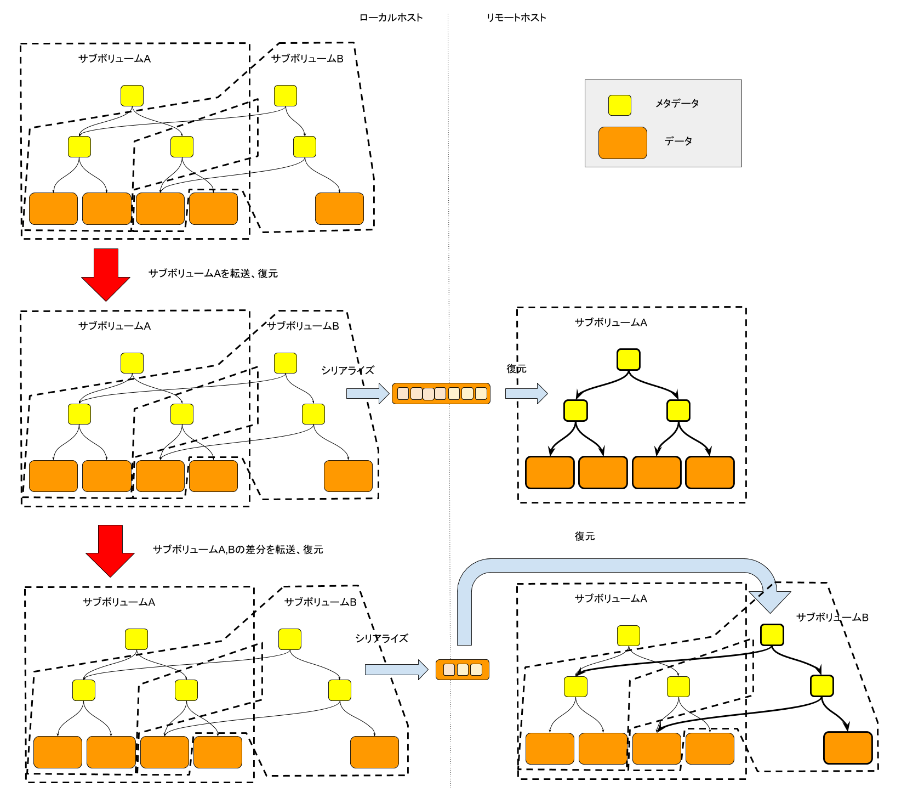

# RAID

BtrfsではRAID構成を組めます。サポートしているのはRAID0,1,10,5,6、それにdup(同じデータを同じデバイスに二重化。シングルデバイス用)です。このうち、本書執筆時点ではRAID5,6はまだ安定していないため、一般ユーザが使うものではなく、開発者がテスト用に使うものという扱いです。どのRAIDレベルにするかという設定の単位はサブボリュームごとではなく、Btrfsファイルシステム全体です。

RAID無しの構成の例を見てみましょう。次の図では、sdaとsdbの上に作成したsingle構成のBtrfsファイルシステムにサブボリュームAが存在しています。このときsdaが壊れるとサブボリュームAのデータは全て失ってしまいます。

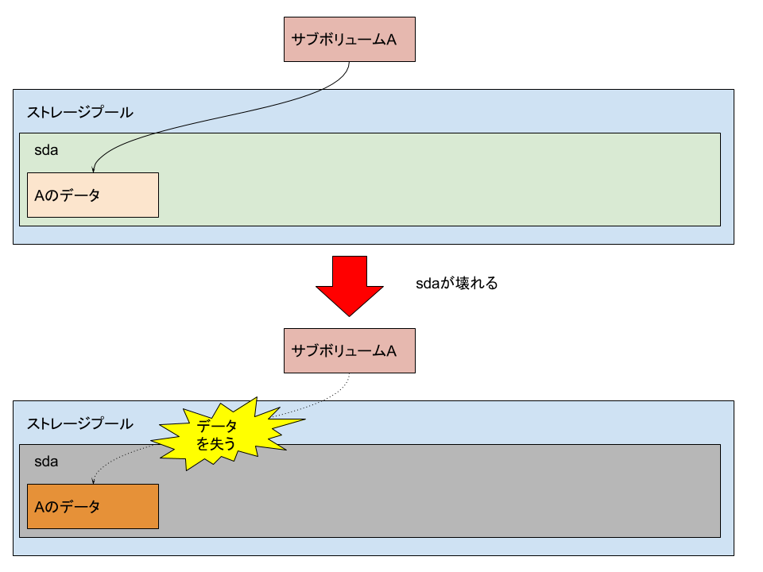

これに対して同ファイルシステムをRAID1構成にしていれば、すべてのデータは2つのストレージ(この場合はsdaとsdb)に書かれるため、sdaが壊れてもAのデータはsdb上に残っています。

要件に応じて、ユーザのデータそのものと、データの格納場所やファイルの属性などのを保持するメタデータに対して、別のRAID構成をすることもできます。後からRAID構成を変更することもできます。

# データ破壊検知/修復

Btrfsにおいてはストレージ内の一部のデータが破壊した場合にそれを検知し、所定のRAID構成なら修復もします。このような機能を持たないファイルシステムでは次の図のように、書き込み時のビット化けなどの様々な理由によってストレージ内のデータが破壊されても、それを検出できないために、そのまま運用継続してしまいます。

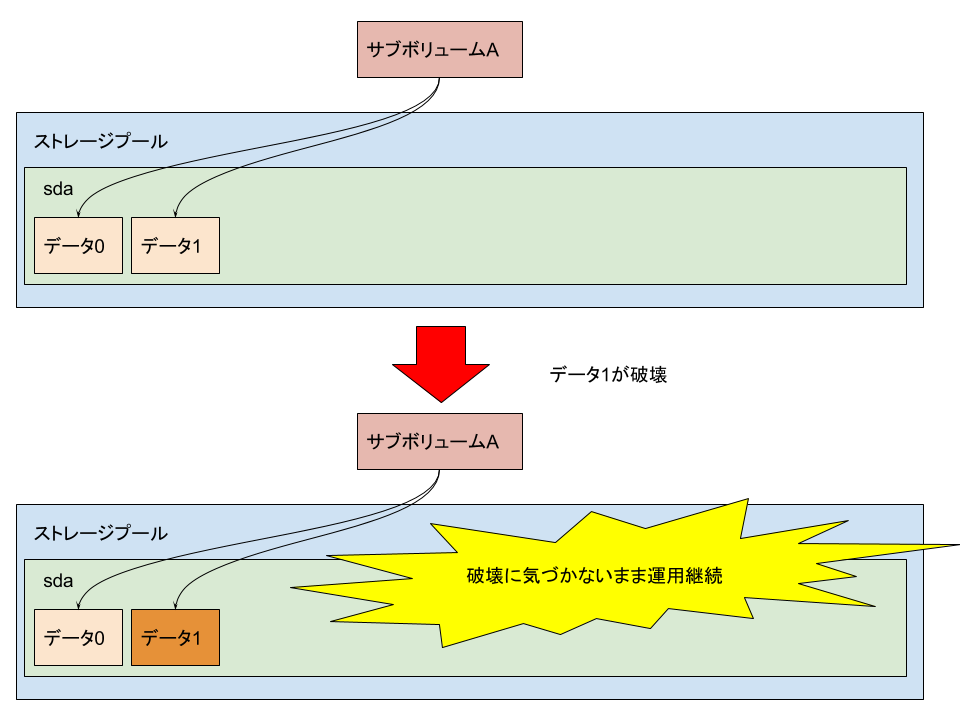

これをきっかけにさらなるデータ破壊が起きることもありますし、このような障害は原因究明が困難でもあります。

その一方でBtrfsはデータ、メタデータ共に、所定のデータ長ごとにチェックサムを持つことによってデータの破壊検知が可能です。次の図のように、データ(あるいはメタデータ)を読み出す際にチェックサムエラーを検出すると、そのデータは捨てて、読み出しを依頼したユーザプログラムにはI/Oエラーが通知されます。

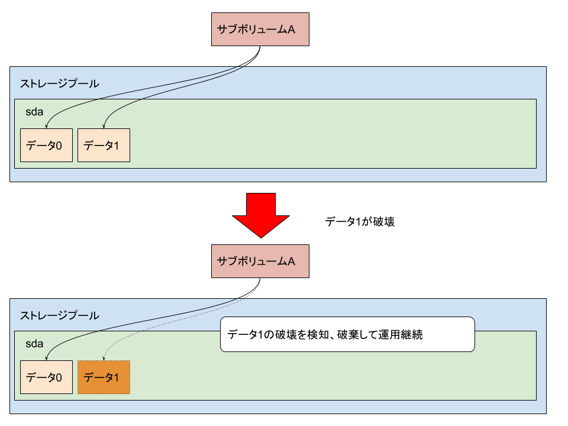

このときRAID1,10,5,6,dup構成であれば、もう一方のチェックサムが一致する正しいデータをもとに、破壊されたデータを修復します。RAID5,6の場合もパリティを使って同様のことをします。次の図はRAID1構成の場合の流れです。

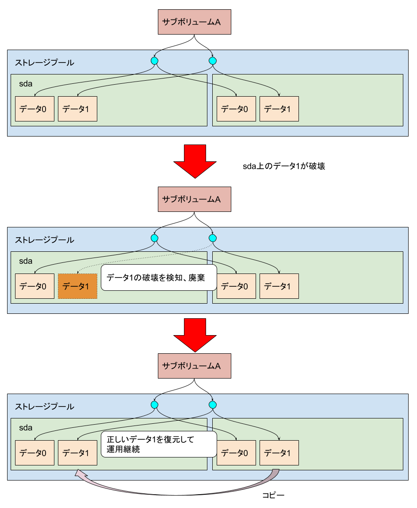

この場合、読み出し元はデータが一時的に壊れていたことを意識せずに、処理を継続できます。

本書執筆時点では、メタデータにチェックサムを付けることによって壊れたメタデータを検出、破棄できるファイルシステムは他にも存在しますが、データもメタデータも検出、破棄、修復可能なファイルシステムはBtrfsのみです。

ユーザにより読み出された個々のデータの破壊検知/修復だけではなく、scrubと呼ばれるファイルシステム全体の走査によって、すべてのデータについての破壊検知/修復も可能です。scrubは運用を止めることなく、オンラインで実行可能です。

# サブボリュームクォータ

上述の通り、同じBtrfsファイルシステム上の各サブボリュームは1つのストレージプールを共有します。ただし、個々のサブボリュームによるストレージプールの最大使用量を制限することもできます。これがサブボリュームクォータという機能です。サブボリュームは従来型ファイルシステムには無いBtrfs固有の概念なので、サブボリュームクォータは従来型のファイルシステムにおけるユーザごとのクォータ、あるいはディレクトリごとのクォータと同様のことをするには工夫が必要です。前者についてはユーザのホームディレクトリごとにサブボリュームを作る、後者についてはクォータ制限をつけたいディレクトリはサブボリューム化をする必要があります。

次の図に示すのは100GBのBtrfsファイルシステムに、それぞれ"/"以下、"/home/foo"以下、および"/home/bar"以下に存在する3つのサブボリュームA,B,Cです。Aはファイルシステムツリー全体を示すため、quotaの制限はかかっていません(制限をかける意味がありません)。それに対して2人のユーザfoo,barのホームディレクトリに対応するサブボリュームB,Cにはそれぞれ30GBの制限をかけており、これらユーザがストレージプールの領域をすべて使いつくすのを避けています。

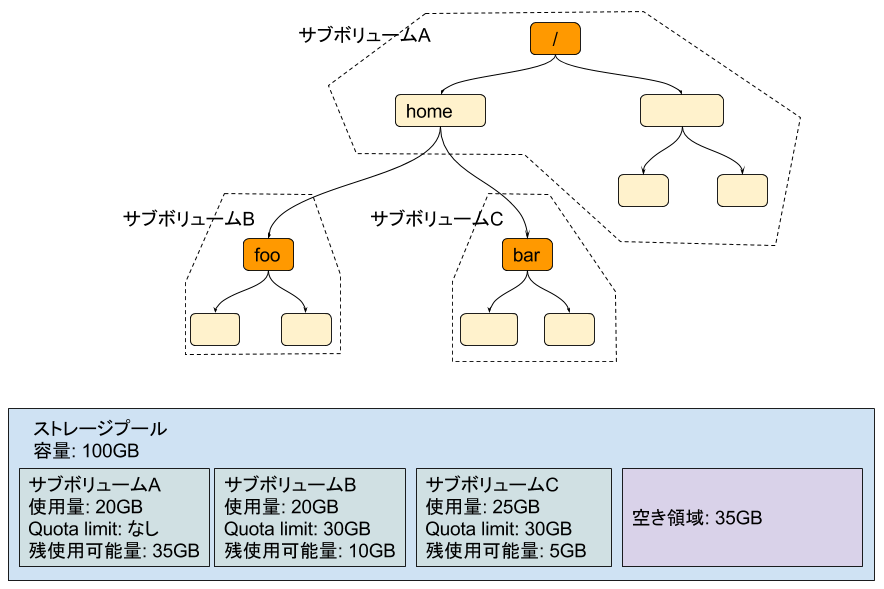

サブボリュームAはクォータ制限をかけていないので、ストレージプールの空き容量35GBをすべて利用可能です。それに対してサブボリュームB,Cはクォータによる30GBの使用量制限があるために、残り使用可能量は30GBから現在の使用量を引いた、それぞれ10GB,5GBです。

# 透過的圧縮

ユーザデータを圧縮してストレージ使用量、およびI/O帯域を減らすこともできます。ユーザデータの書き込み時に、データを一旦圧縮した上でストレージに書き込みます。その後に当該データが読み出される際は、今度は圧縮されたデータを展開して元のデータに復元します。

次の図は通常のI/Oの様子を表しています。

次の図は透過的圧縮を有効にした場合のI/Oの様子です。

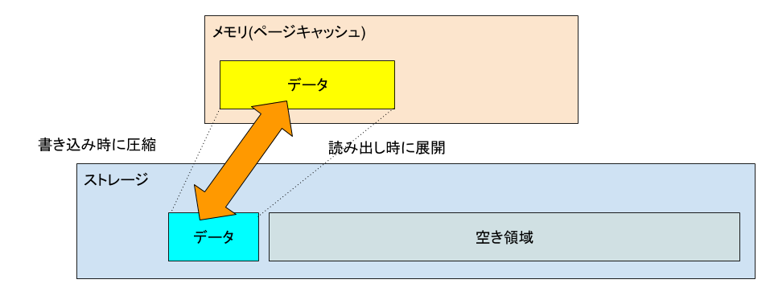

上の図よりも下の図のほうがI/O量、ストレージ使用量ともに少なくなっていることがわかります。

この機能を使うとデータの圧縮、展開に追加のCPUリソースが必要になるため、使用前には十分な評価が必要です。CPUリソースが有り余っているようなシステムではこの機能は有用である一方、非力なCPUを搭載したシステムにおいては、システムの運用に必要なCPUリソースが足りなくなるという問題が発生する恐れがあります。

# 重複排除

ファイルシステム内に同じデータ領域が重複して存在する場合に、全ての参照元から1つのデータを参照して残りのデータは解放することによって、ストレージ使用量を削減します。

!(dedupe)[images/dedupe.png]

複数個所から参照されているデータ領域が書き換えられた場合は、コピーオンライトの仕組みによって、書き換え後のデータはストレージ上の別の場所に書き込まれます。

現在のところ、重複解除は後述のdupremoveコマンドによって明示的に実行します。データの書き込み時に自動的に重複排除する機能が[現在開発中](features_in_development.md#書き込み時の重複排除)です。

# デフラグ

ファイルシステムを長い間使っていると、あるファイルのデータがストレージプール内のそれぞれ異なる複数の位置に分散配置されるようになってきます。これをフラグメントと呼びます。フラグメントが発生すると、例えば、あるファイルをシーケンシャルに読み出す際に、ファイルに対応するデータが一つの連続領域に固まっていないため、とくにHDDの場合において、フラグメントしていない状態に比べて読み出し性能が劣化します。

次に示すのは、ファイルシステム作成直後にファイルAを作成した状態です。

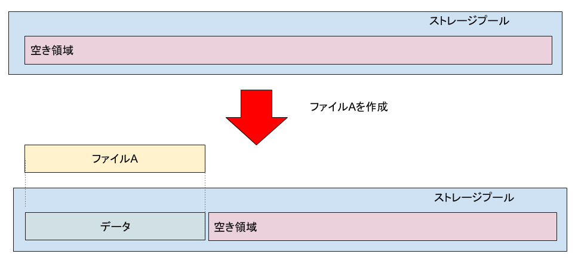

ファイルのすべてのデータがストレージプール内の連続領域に確保されていることがわかります。

次に示すのは、ファイルシステムを長期間使用した後にファイルAを作成した状態です。

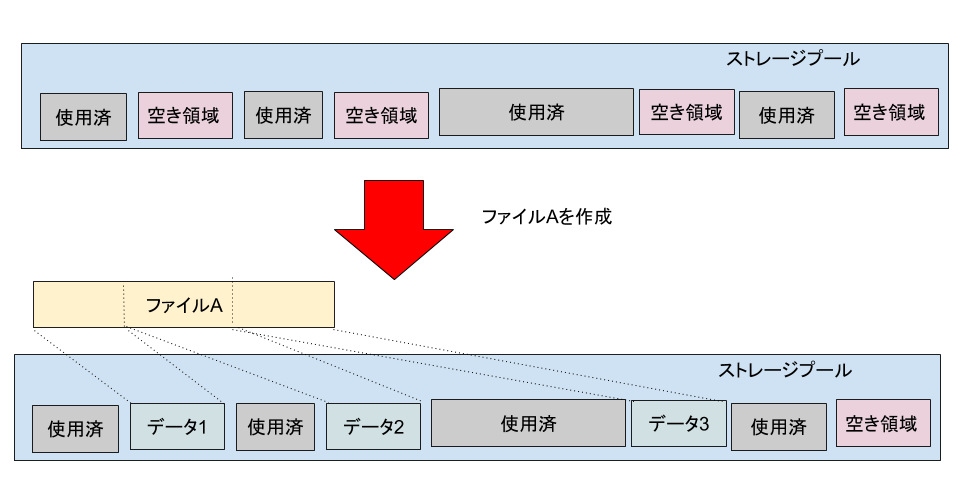

こちらはファイルのデータがストレージプール内の複数個所にまたがって確保されている、つまりフラグメントしていることがわかります。

Btrfsの管理コマンドを使えば、次の図のように、ファイルのフラグメントを解消できます。

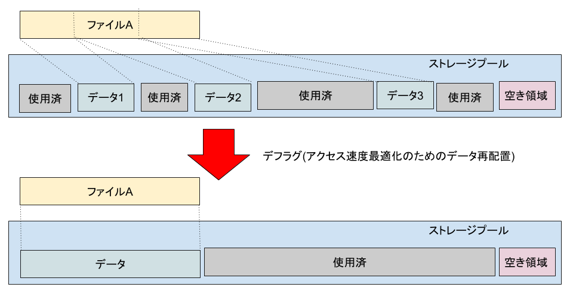

この操作をデフラグと呼びます。デフラグはファイルシステムの運用を止めることなく、オンラインで実施できます。

自動的にデフラグさせるオートデフラグという機能もあります。ただしオートデフラグを使用すると、通常のシステム負荷に加えて、常にデフラグ処理の負荷も増えるようになります。このため、オートデフラグによって増えるCPUの処理速度やI/O量が許容できるものであるかを判断した上で使用可否を決定する必要があります。
